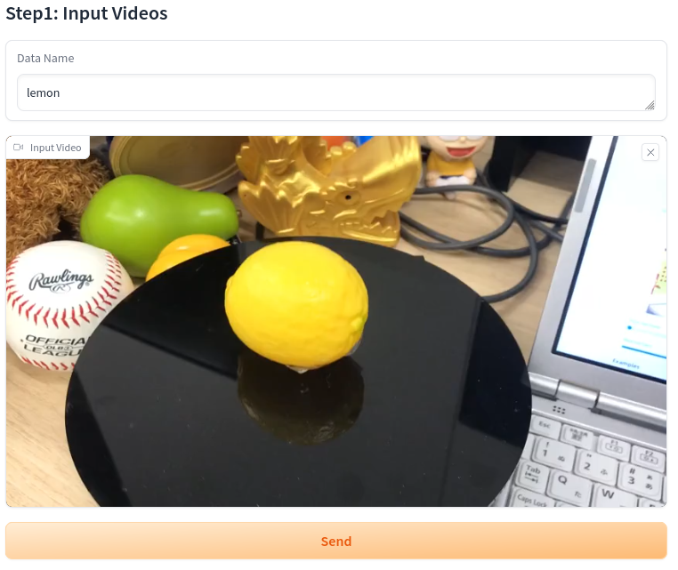
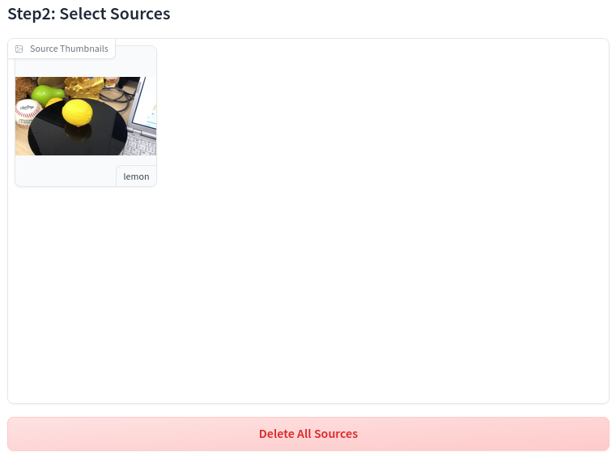
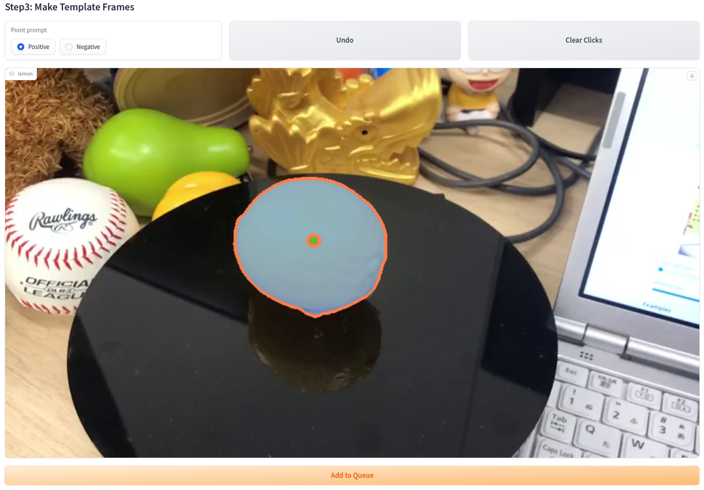
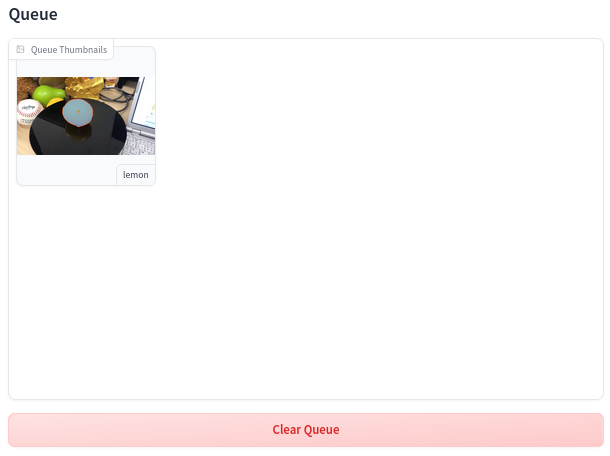
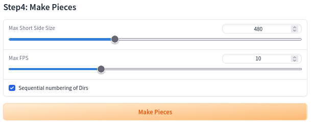
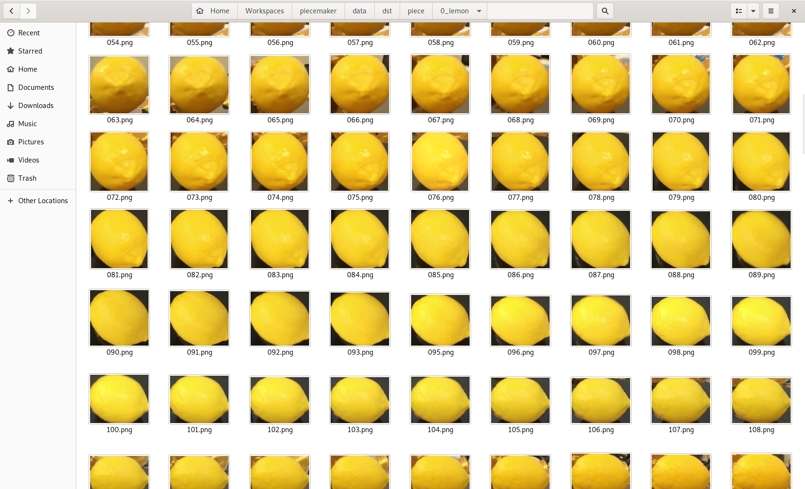

# PieceMaker

動画内の任意のオブジェクトを追跡し、それを切り抜き、データセットを作成するツール。

### 使い始める

#### 事前に必要なもの

- Python >= 3.8
- PyTorch
- CUDA
- Webブラウザ

#### インストール

```sh
cd
git clone --recursive https://github.com/0xNOY/piecemaker.git
cd piecemaker
pip install -U -r requirements.txt
```

#### 実行

```sh
cd ~/piecemaker
python main.py
```

`Running on local URL: ...` と表示されたら、ブラウザでそのURLにアクセスする。

#### 使い方

1. データセットを作成したい動画と、その動画内のオブジェクトの名前を入力し、`Send`をクリックする。  
    
2. 追跡するオブジェクトを指定する動画を選択する。  
    
3. 画像をクリックし、オブジェクトのマスクを作成し、`Add to Queue`をクリックする。  
    
4. 同時に処理したい分だけ1~3を繰り返す。
5. キューに追加した画像を確認する。  
    
6. `Make Pieces`をクリックする。  
    
7. `Queue`に表示されたアニメーションが終了すると、`piecemaker/data/dst/piece/<オブジェクト名>`にオブジェクトを切り抜いた画像が保存される。  
    